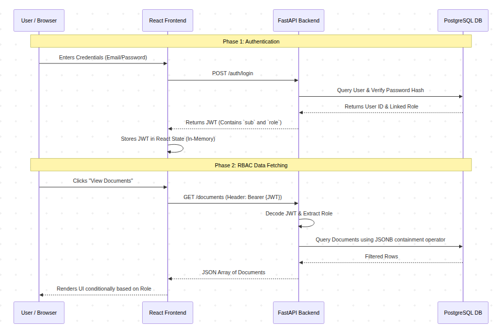

# 📚 Fineto Digital Library System

A full-stack digital library application built with **FastAPI**, **PostgreSQL**, and **React**. The application implements secure authentication using JWTs and Role-Based Access Control (RBAC), ensuring users can only access the resources permitted by their role.

---

## ✨ Features

* 🔐 JWT-based authentication
* 👥 Role-Based Access Control (Admin, Editor, Viewer)
* 📚 Create, view, update, and delete library documents
* 🔍 Search and filter documents
* ⚡ Secure FastAPI backend
* ⚛️ React + TypeScript frontend
* 🐳 Fully containerized with Docker Compose
* 📖 Interactive Swagger API documentation

---

## 🛠 Tech Stack

### Backend

* FastAPI
* SQLAlchemy
* PostgreSQL
* JWT Authentication
* Passlib (Password Hashing)

### Frontend

* React
* TypeScript
* Vite
* React Context API

### DevOps

* Docker
* Docker Compose

---

## 🏗️ Architecture

The application follows a typical three-tier architecture:

```text
Browser (React)
        │
        ▼
FastAPI REST API
        │
        ▼
PostgreSQL Database
```

Authentication is completely stateless. After a successful login, the backend issues a JWT containing the user's identity and role. The frontend stores this token in memory and sends it with each authenticated request.

The diagram below illustrates the overall system architecture and authentication flow.

<p align="center">
  
</p>

---

## 📁 Project Structure

```text
.
├── docker-compose.yml
├── backend/
│   ├── app/
│   ├── Dockerfile
│   ├── requirements.txt
│   └── schema.sql
└── frontend/
    ├── src/
    ├── Dockerfile
    ├── package.json
    └── vite.config.ts
```

---

## 🚀 Getting Started

### 1. Clone the repository

```bash
git clone https://github.com/HaileleulGirma/Digital-Library
cd Digital-Library
```

### 2. Build and run

From the project root:

```bash
docker compose down -v
docker compose up --build
```

The first command removes any existing containers and database volumes to ensure a clean start.

---

## 🌐 Access the Application

| Service     | URL                        |
| ----------- | -------------------------- |
| Frontend    | http://localhost:3331     |
| Backend API | http://localhost:8000      |
| Swagger UI  | http://localhost:8000/docs |

---

## 👤 Test Accounts

You can register the following users through the Swagger UI (`/auth/register`) using any password.

| Email                                       | Role   |
| ------------------------------------------- | ------ |
| [admin@gmail.com](mailto:admin@gmail.com)   | Admin  |
| [editor@gmail.com](mailto:editor@gmail.com) | Editor |
| [viewer@gmail.com](mailto:viewer@gmail.com) | Viewer |

---

# 💡 Design Choices

## Authentication

The application uses **JWT authentication** to keep the backend stateless. Once a user logs in successfully, the backend generates a signed token containing the user's email and role. Every protected request includes this token, allowing the backend to verify the user's identity without maintaining server-side sessions.

To reduce the impact of potential XSS attacks, the JWT is stored only in the React application's memory instead of `localStorage` or `sessionStorage`. The trade-off is that users must log in again after refreshing the page, but the token cannot be stolen from persistent browser storage.

---

## Role-Based Access Control (RBAC)

RBAC is enforced in multiple layers rather than relying solely on the frontend.

### Database

Each user is assigned a single role through the database schema, making the database the source of truth for permissions.

Documents store the roles allowed to access them using PostgreSQL's **JSONB** type. This allows the database to efficiently filter accessible documents before they're returned to the application.

---

### Backend

Protected endpoints use FastAPI dependencies to verify both authentication and authorization before any business logic executes.

To satisfy the requirement for custom RBAC middleware, I implemented a custom callable class named `RoleChecker`. This dependency intercepts incoming requests, validates and decodes the JWT, and compares the user's role against a predefined list of allowed roles for each endpoint. If the role is not authorized, the request is immediately rejected with a **403 Forbidden** response.

By keeping the authorization logic inside this reusable dependency, the endpoint implementations remain clean, consistent, and free from duplicated permission checks without relying on any third-party RBAC library.

---

### Frontend

The frontend never assumes permissions—it simply reflects what the backend allows.

React Context stores the authenticated user's information, allowing components to conditionally render pages, buttons, and actions based on the current role. Users only see the features they are permitted to access, resulting in a cleaner interface while the backend remains responsible for enforcing security.

---

## 🐳 Docker

Docker Compose manages the frontend, backend, and PostgreSQL database as separate services connected through Docker's internal network.

The database schema, **including the insertion of the default system roles (`admin`, `editor`, and `viewer`)**, is automatically initialized during container startup. No manual database setup is required before running the application.

---

## 📄 License

This project was developed as part of the **Fineto Technical Assessment**.
